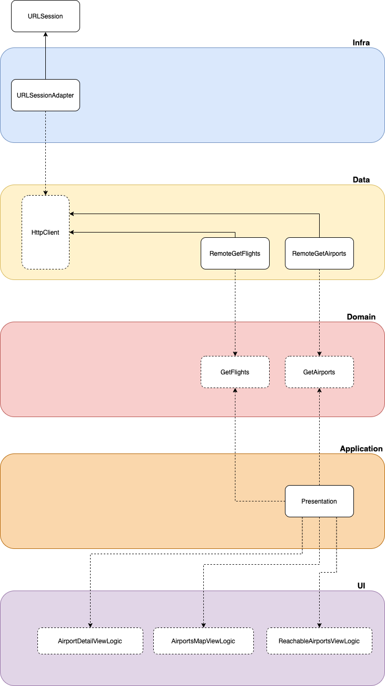

# SchipholAirport
An iOS application written in Swift using the Clean Architecture design that consumes a REST API to show relevant information about the Schiphol Airport.

## Project Structure

- **SchipholAirportApp** (app target)
- **Application**: application layer target implemented with the Clean Swift pattern.
- **UI**: contains the whole UI abstractions and implementations used by the application.
- **Domain**: contains the application's use cases abstractions and the core entities.
- **Data**: contains the use cases implementations and external interfaces abstractions.
- **Infra**: contains the implementation of the external interfaces abstractions like an http client.

## Instructions

Make sure you have a Xcode version compatible with Swift 5. Open the *.xcodeproj* file and you are free to run the app.

Choose between the following schemes:
- **SchipholAirportApp**: Run this scheme to run the app.
- **Application**: Build this scheme to create the application layer framework (or **Cmd + U** to run its unit tests).
- **UI**: Build this scheme to create the UI layer framework (or **Cmd + U** to run its unit tests).
- **Domain**: Build this scheme to create the Domain layer framework.
- **Data**: Build this scheme to create the Data layer framework (or **Cmd + U** to run its unit tests).
- **Infra**: Build this scheme to create the Infra layer framework (or **Cmd + U** to run its unit tests).
- **UseCaseIntegrationTests**: **Cmd + U** to run the integration tests for several use cases.
- **CI**: Used by the CI to build the project and run all unit tests and integration tests.

## App Architecture Overview

